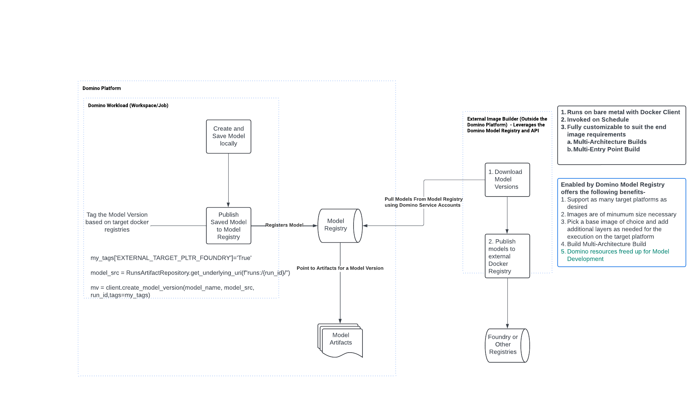

## Publish a Domino Model to an External Model Registry

The design for this workload is outlined in this .
## First Create and Register a model

For this we have provided a [notebook](./register_models.ipynb). 

The first section shows you how to create a model and register it. This is a scikit learn model
but any model can be registered using MLflow API supported by Domino

When you register the models go the "Experiments" page in Domino and view the artifacts for the runs

The folder structure is crucial.
- `mymodel` (All the model definitions and model binaries are stored here. The model is loaded from this folder)
- `client` (The client programs, for example, those going to the ENTRYPOINT in the Dockerfile endup here)
- `templates` (Contains `Dockerfile.template` and `create_docker_image.sh.template`)

The reason we have templates for the Dockerfile is because we cannot yet resolve them.
The resolution to `Dockerfile` and `create_docker_image.sh` needs the `model_version` that is assigned
after the artifacts are registered. Note that we do not need these files at all. The downstream client
program can use their own if they know the folder structure for the artifacts

## Build, Publish and Run Image to an external registry    

```
export DOMINO_USER_API_KEY=<DOMINO_USER_API_KEY>
export DOMINO_RUN_ID=<DOMINO_RUN_ID>
export MLFLOW_TRACKING_URI=<MLFLOW_TRACKING_URI>

./download_models.py "/tmp/foundry_models"
```
1. You need a valid run id for this project for the above API key. Either run a job and fetch it
The runid need not be active. We could also use the Domino API to start a dummy job and create
a run id dynamically.
2. Example for the tracking uri is `export MLFLOW_TRACKING_URI=https://secureds53799.cs.domino.tech/`

```shell
cd /tmp/foundry_models
ls /tmp/foundry_models/

#You will see a folder for all registered models. I see only one because I have only one
/tmp/foundry_models/
- foundry_model
- pltr_foundry_model

cd /tmp/foundry_models/pltr_foundry_model

```
Now you will see a folder structure for all versions for which the tag `EXTERNAL_TARGET_PLTR_FOUNDRY` was added to the 
model version
```shell
/tmp/foundry_models/pltr_foundry_model
- v7
```


Go the most recent one

```shell
cd /tmp/foundry_models/pltr_foundry_model/v5

chmod 755 create_docker_image.sh
./create_docker_image.sh
```

This will publish the model to  `quay.io/domino/pltr_foundry_model:v5` (Or your registry) and also run it locally for you

## Key Takeaways

The process is fully automated as follows-

1. The Domino user will register models using specific protocols (Tags and Artifact locations). We can wrap this in a 
utility libraries. This process is outlined in the [notebook](./register_models.ipynb)
2. The `download_models.py` will run on schedule and download the models matching the appropriate tags
3. Each downloaded model will have a `create_model_image.sh` and `Dockerfile` along with other artifacts
4. The process to run these for non-published models will also be run on schedule

The end result is depending on the cadence (2,3,4) runs, the model images will be available in foundry.

If the cadence is 15 mins, the image will be available in 15 mins after the Domino user publishes the model.

The steps 2,3,4 are lightweight allowing us to have a more frequent executions

## Benefits of this approach

Domino introduced the Model Registry along with its new Experiment Manager. The purpose of the model 
registry to encourage users to publish models which can be **run anywhere**. 

Anywhere includes any execution architecture, `linux/amd64`, `linux/arm64`, `linux/arm/v7` or any new
one that emerges in the future. 

The other benefit if this approach is, it allows you to create  docker image of minimum size possible
to run on the target platform. This reduces startup times as well as makes the model execution
process as cost efficient as possible. If you want to bundle the Domino models from Domino Model
Registry into an existing image, you are free to do so by using it as the base image. The Model
Registry only contains the model artifacts and the metadata about the execution environment such as
- `conda.yaml`, `python_env.yaml` and `requirements.txt`


## Alternative approach using Kaniko in the K8s cluster


We could run the build using Kaniko. First create the image which downloads the models from Model Registry
and builds them in Kaniko and pubishes them back to `quay.io/domino` . You can adapt this code to publish to any
registry.

```shell
docker build --platform=linux/amd64  -f ./Dockerfile -t  quay.io/domino/kaniko-based-modelregistry-push:v3 .
docker push quay.io/domino/kaniko-based-modelregistry-push:v3    
```

This builds the image based on the `Dockerfile` in the root folder. The full Dockerfile is below:

```shell
FROM gcr.io/kaniko-project/executor:v1.23.2 as kaniko
FROM python:3.9-slim

# Copy Kaniko executor from the previous stage
COPY --from=kaniko /kaniko /kaniko
# Ensure Kaniko executor is executable
RUN chmod +x /kaniko/executor
RUN chmod 777 /kaniko/
ENV PATH=$PATH:/home/app/.local/bin:/home/app/bin
ENV PYTHONUNBUFFERED=true
ENV PYTHONUSERBASE=/home/app

#RUN groupadd --gid 1000 domino && \
#    useradd --uid 1000 --gid 1000 domino -m -d /app
#RUN apt-get update \
#    && apt-get upgrade --yes \
#    && apt-get install -y --no-install-suggests --no-install-recommends \
#    curl \
#    && apt-get clean \
#    && rm -rf /var/lib/apt/lists/*
RUN pip install mlflow pyjwt
WORKDIR /app
COPY  *.py  .
#USER 1000
ENTRYPOINT ["python","/app/publish_models.py"]
```

This has to run as root. If I run it as another user `kaniko` builds throw and error which looks like this
```shell
INFO[0001] Building stage 'quay.io/domino/python-slim:3.9.16-slim-bullseye-356299' [idx: '0', base-idx: '-1']
INFO[0001] Unpacking rootfs as cmd RUN groupadd --gid 1000 domino &&     useradd --uid 1000 --gid 1000 domino -m -d /app requires it.
error building image: error building stage: failed to get filesystem from image: chown /bin: operation not permitted
```

Next run the example kaniko pod in the path `./k8s/kaniko-pod.yaml`. You will find two environment varialbes in the yaml
- `MODEL_NAME` - This is the name of the model registered to the Domino Model Registry
- `MODEL_VERSION` - This is the version of the model registered to the Domino Model Registry

Note that if your `Dockerfile` based on the `./template/Dockerfile.template` uncomment this section the kanio build will fails
```shell
#RUN apt-get update \
#    && apt-get upgrade --yes \
#    && apt-get install -y --no-install-suggests --no-install-recommends \
#    curl \
#    && apt-get clean \
#    && rm -rf /var/lib/apt/lists/*
```

In my example I used

```shell
MODEL_NAME=pltr_foundry_model
MODEL_VERSION=8
```

Now create the pod

```shell
kubectl -n domino-compute delete pod kaniko-domino-model-registry
kubectl -n domino-compute apply -f kaniko-domino-model-registry
kubectl -n domino-compute logs -f kaniko-domino-model-registry
```

The logs will show you that the build and push takes approximately 55 seconds. Compared to around 40 seconds from
the laptop